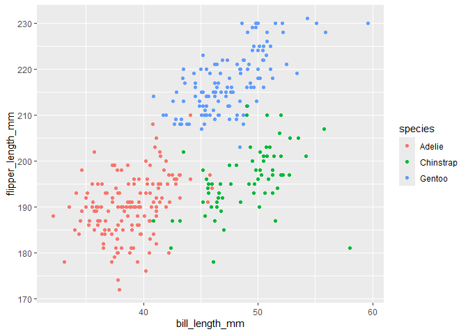

p8105_hw1_xl3495
================

``` r
#load the dataset
data("penguins", package = "palmerpenguins")
```

# Problem 1

``` r
row = nrow(penguins)
col = ncol(penguins)
flipper_length = penguins$flipper_length_mm
mean_flipper_length = mean(flipper_length,na.rm = TRUE)
```

The `penguins` dataset has 8 variables in total and the size of the
dataset is 2752 (*nrow*:344; *ncol*:8). The variables basically
describes features of penguins such as `species`(Adélie, Chinstrap and
Gentoo), `body_mass`, `sex`(male/female) and `year`. Also, variables
like `bill_length_mm` and `bill_depth_mm` describes the bill length and
depth in millimeters separately. The variable `flipper_length_mm` is an
integer denoting flipper length in millimeters, with 200.9152047mm in
average.

The scatterplot of `flipper_length_mm (y)` vs `bill_length_mm (x)`:

``` r
#import library
library(tidyverse)
```

    ## ── Attaching core tidyverse packages ──────────────────────── tidyverse 2.0.0 ──
    ## ✔ dplyr     1.1.4     ✔ readr     2.1.5
    ## ✔ forcats   1.0.0     ✔ stringr   1.5.1
    ## ✔ ggplot2   3.5.1     ✔ tibble    3.2.1
    ## ✔ lubridate 1.9.3     ✔ tidyr     1.3.1
    ## ✔ purrr     1.0.2     
    ## ── Conflicts ────────────────────────────────────────── tidyverse_conflicts() ──
    ## ✖ dplyr::filter() masks stats::filter()
    ## ✖ dplyr::lag()    masks stats::lag()
    ## ℹ Use the conflicted package (<http://conflicted.r-lib.org/>) to force all conflicts to become errors

``` r
#create a scatteplot
plot = ggplot(penguins, aes(x = bill_length_mm, y = flipper_length_mm, color = species))+geom_point()
# Save as a JPEG
ggsave("scatter_plot.jpeg", plot = plot)
```

    ## Saving 7 x 5 in image

<!-- -->

# Problem 2

``` r
#create a data frame
#library(tidyverse) already loaded
df = tibble(
  norm_samp = rnorm(10),
  vec_logical = norm_samp > 0,
  vec_char = c("apples",
               "bananas",
               "chocolates",
               "daikon radish",
               "eggplant",
               "fudge",
               "grapes",
               "honeydew_melon",
               "ice_cream",
               "jicama"),
  vec_factor = factor(c("fruit",
                        "fruit",
                        "snack",
                        "vegetable",
                        "vegetable",
                        "snack",
                        "fruit",
                        "fruit",
                        "snack",
                        "vegetable"
                        ))
)
```

## Mean of Each Variable

``` r
mean_norm_samp = mean(df %>% pull(norm_samp))
```

This returns a mean of 10 random samples from a standard normal
distribution. Mean: 0.2470794, which is a numeric value.

``` r
mean_vec_logical = mean(df %>% pull(vec_logical))
```

This returns a mean of logical factor. Here, `TRUE` is coerced to `1`
and `FALSE` is coerced to `0`. Mean: 0.5, which is a numeric value. This
way, it is convenient to determine the proportion of `TRUE` values.

``` r
mean_vec_char = mean(df %>% pull(vec_char))
```

    ## Warning in mean.default(df %>% pull(vec_char)): argument is not numeric or
    ## logical: returning NA

This returns `NA` with the warning above.

``` r
mean_vec_factor = mean(df %>% pull(vec_factor))
```

    ## Warning in mean.default(df %>% pull(vec_factor)): argument is not numeric or
    ## logical: returning NA

This returns `NA` with the warning above.

``` r
#Trying to coerce with as.numeric() function
as.numeric(df %>% pull(vec_logical))
as.numeric(df %>% pull(vec_char))
as.numeric(df %>% pull(vec_factor))
```

Logical and factor variables can be coerced to numeric values while
character variable cannot (`NA`s introduced by coercion for character
variables). I think this is because logical and factor variables has the
meaning of **categories** or **levels**, while the meaning of character
variables differ from each other. However, mean can be only calculated
with numeric values, so the character variables have no mean, returning
nothing but `NA`s.
